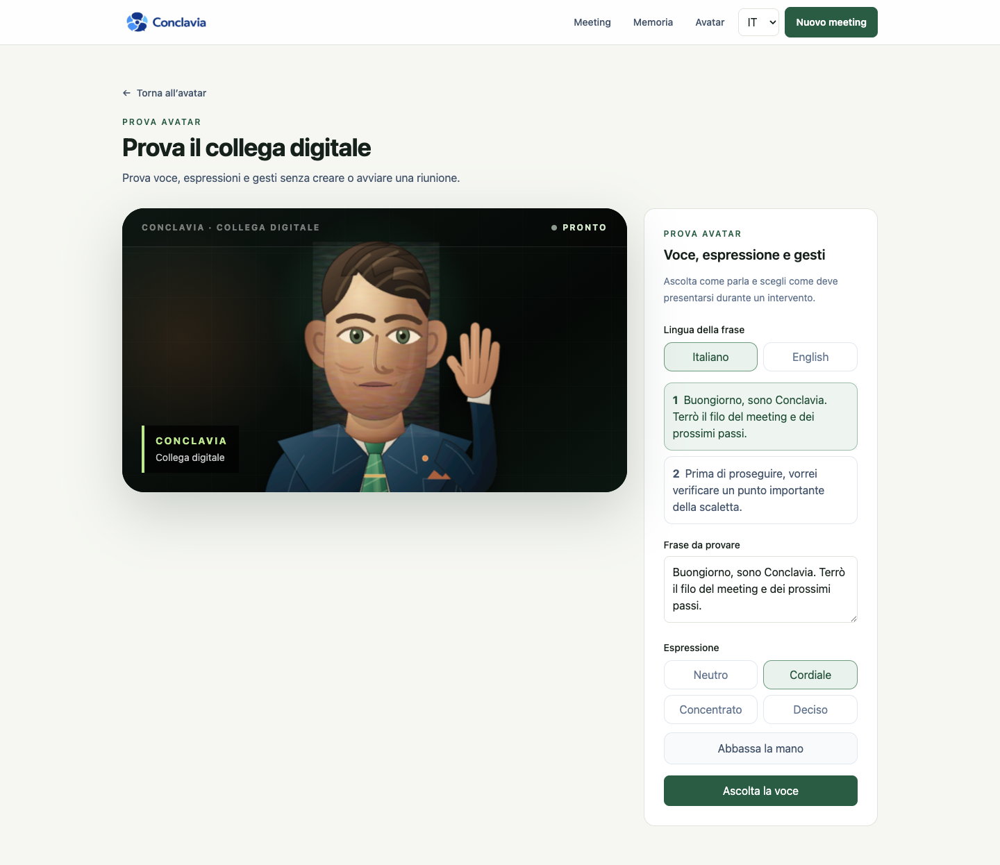
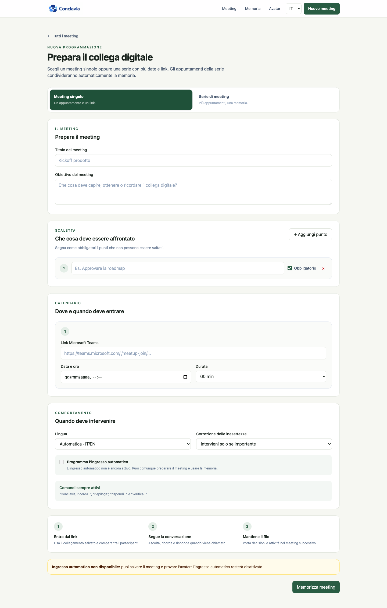
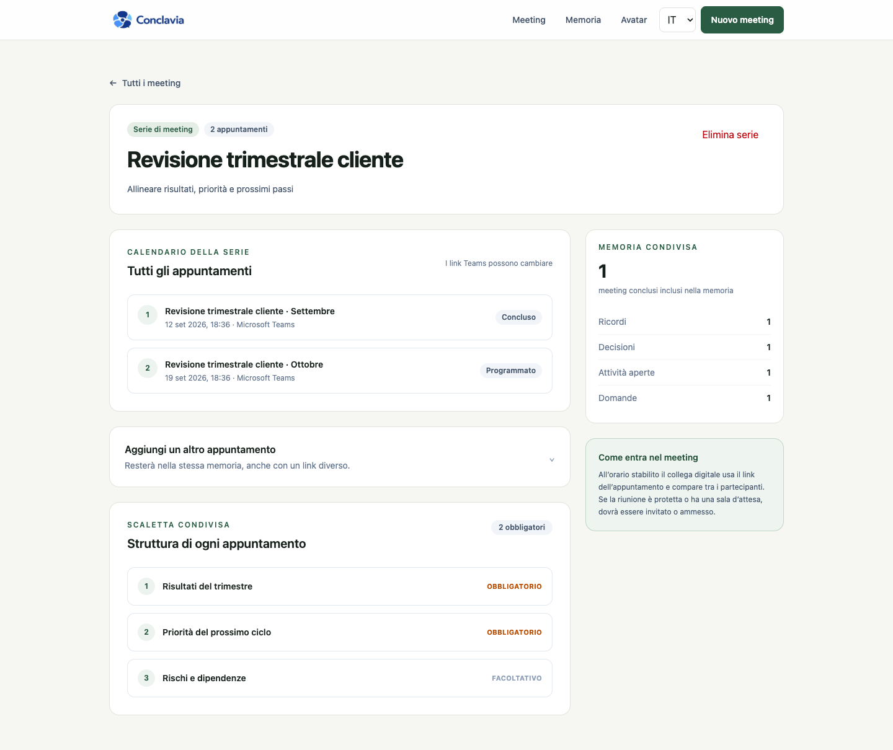

<p align="center">
  
</p>

<p align="center">
  A digital colleague for Microsoft Teams that follows the agenda, answers in the meeting, and carries memory into the next appointment.
</p>

# Conclavia Meeting Assistant

Conclavia is a focused, single-workspace meeting assistant. The product contains three areas only:

- **Meetings** for one appointment or a series of Microsoft Teams meetings.
- **Memory** for remembered facts, decisions, actions, questions, and summaries.
- **Avatar** for the digital colleague's identity, personality, voice, expressions, and hand raise.

The management interface works without a meeting provider. Automatic Teams entry is fail-closed and becomes available only after every required integration setting is present.

## Product tour

### Avatar and voice test

The avatar can be tested independently from a meeting, including Italian and English voice, facial mood, audio-driven lip sync, and hand raise.



### One meeting or a series

Every meeting has an objective, a Teams link, a date, and an agenda whose items can be mandatory or optional. A series can contain up to 24 appointments with different Teams links.



### Shared meeting memory

Completed appointments contribute their summary, remembered facts, decisions, open actions, and questions to the next appointment in the same series.



## Meeting behavior

The wake phrase is **“Conclavia…”**. Four commands are supported in Italian and English:

- **Remember** stores an explicit fact in the current meeting memory.
- **Summarize** creates a spoken summary and stores it as the meeting overview.
- **Answer** responds from the current transcript and shared series memory.
- **Verify** checks a statement against known meeting facts and decisions.

When the correction policy is set to important inaccuracies, Conclavia periodically checks substantive statements against reliable stored memory. It speaks only when a clear, material conflict is found. The checks are rate-limited to control cost and interruptions.

The assistant personality has two deliberately simple controls: response length and attitude. Those choices are included in the meeting prompt.

## Runtime architecture

```text
Microsoft Teams meeting
        │
        ▼
Recall.ai signed-in participant + live transcript
        │
        ▼
Conclavia meeting output page
        ├── wake phrase and command routing
        ├── MongoDB transcript and series memory
        ├── OpenAI Responses API for meeting intelligence (optional)
        └── local Supertonic voice + lip sync + expressions
        │
        ▼
Avatar video and spoken response returned to Teams
```

Recall Output Media loads the protected `/meeting-room/[token]` page as the participant camera. That page consumes Recall's in-meeting transcript WebSocket, forwards finalized utterances to the matching meeting, and plays newly generated speech into the meeting. No virtual microphone, virtual camera, browser extension, or client-side Teams plugin is required.

## Cost controls

- Speech is generated on the meeting device with Supertonic 3. There is no per-character voice API charge.
- ChatGPT-backed intelligence is opt-in through `MEETING_AI_ENABLED=true`. Remembering facts and the deterministic memory fallback work without it.
- The default model is `gpt-5.4-mini`; it can be changed with `OPENAI_MEETING_MODEL`.
- Audio is not stored. The live transcript and selected memory are stored in MongoDB.
- No external meeting participant is created while `MEETING_BOT_PROVIDER=preview`.

The Supertonic model is downloaded on first voice use and cached by the browser. Review [THIRD_PARTY_NOTICES.md](THIRD_PARTY_NOTICES.md) before distribution.

## Requirements

- Node.js 22 recommended; Node.js 20.9 or newer is supported.
- MongoDB.
- Google Chrome for the Playwright browser suite.
- For authenticated automatic entry: a Recall.ai workspace and a dedicated Microsoft 365 Business tenant for the bot, separate from the existing company tenant.
- For generated answers and semantic verification: an OpenAI API project.

## Local setup

```bash
npm ci
cp .env.example .env.local
npm run dev
```

Set `MONGODB_URI`, then open [http://localhost:3000/meetings](http://localhost:3000/meetings). Local mode stores meetings and memory, runs all manual commands, and tests the avatar without joining an external call.

## Environment variables

| Variable | Required | Purpose |
| --- | --- | --- |
| `MONGODB_URI` | Yes | MongoDB connection string. |
| `MEETING_AI_ENABLED` | No | Set to `true` to use OpenAI for summaries, answers, and verification. |
| `OPENAI_API_KEY` | With meeting AI | Server-side OpenAI API credential. |
| `OPENAI_MEETING_MODEL` | No | Responses API model; defaults to `gpt-5.4-mini`. |
| `MEETING_BOT_PROVIDER` | No | Keep `preview` locally; set `recall` for automatic Teams entry. |
| `CONCLAVIA_PUBLIC_URL` | With Recall | Stable public HTTPS origin serving this application. |
| `RECALL_API_BASE_URL` | No | Regional Recall API origin; defaults to `eu-central-1`. |
| `RECALL_API_KEY` | With Recall | Server-side Recall API credential. |
| `RECALL_WEBHOOK_SECRET` | With Recall | Recall verification secret beginning with `whsec_`. |
| `TEAMS_GUEST_ACCOUNT_EMAIL` | With Recall | Dedicated Microsoft identity used by the participant. |
| `TEAMS_GUEST_DISPLAY_NAME` | No | Requested participant name when the provider permits it. |
| `TEAMS_SIGNED_IN_CONFIRMED` | With Recall | Set to `true` only after the Microsoft identity is configured in Recall. |

Never commit real credentials. Inject them through the deployment platform's secret store.

## Microsoft Teams setup

1. Create a dedicated Microsoft 365 Business tenant for Conclavia. Do not reuse a personal account or add the bot to the existing company tenant: Recall's authenticated setup requires organization-level security changes.
2. Create the bot user inside that tenant, assign its Teams license, and set the name and profile picture that should appear in meetings.
3. Add the bot user's sign-in credentials in Recall's Microsoft Teams setup. Keep those credentials in Recall; Conclavia only needs the matching email for scheduling and overlap protection.
4. Apply Recall's documented security configuration only to the dedicated tenant. Interactive MFA or biometric approval cannot be completed by an unattended bot.
5. When the bot joins another organization, have that organization trust the bot domain or add the identity as an external colleague or guest, and include its email in the meeting invitation when appropriate.
6. Configure the Recall status webhook as `https://YOUR_ORIGIN/api/webhooks/recall` and copy its verification secret.
7. Set all Recall and Teams variables listed above, then change `MEETING_BOT_PROVIDER` to `recall` and `TEAMS_SIGNED_IN_CONFIRMED` to `true`.
8. Create a future meeting with automatic entry enabled. Conclavia schedules one participant per appointment and prevents overlapping meetings for the same account.

A signed-in participant may still wait in the lobby, depending on the organizer's Teams policy. The meeting page shows that state so a participant can admit it. Recall signed-in bots support Microsoft Teams Business meetings; test the exact meeting type used by the organization before rollout.

## Verification

```bash
npm run verify
```

This runs ESLint, TypeScript, a production build, and six Playwright scenarios covering:

- single-meeting creation, agenda, commands, memory, and cleanup;
- series creation and continuity across two appointments;
- avatar navigation, facial mood, and hand raise;
- Italian and English wake-phrase command parsing;
- Recall live-transcript payload parsing;
- database health and protected meeting-output behavior.

Tests run on an isolated local port with meeting AI and the external participant disabled. They create uniquely named records and remove them even after a failed scenario, so verification never creates paid external usage.

## Production deployment

The repository includes a multi-stage, non-root Docker image using the Next.js standalone output:

```bash
docker build -t conclavia .
docker run --env-file .env.production -p 3000:3000 conclavia
```

Use `GET /api/health` for readiness checks. Terminate TLS before the application and set `CONCLAVIA_PUBLIC_URL` to the final HTTPS origin.

This release is designed as a private, single-workspace application and does not include end-user authentication. Place the entire management interface and API behind the company's SSO, identity-aware proxy, or equivalent access control before exposing it to the internet. The random meeting-output token acts as a bearer capability and must not be logged or shared.

## Main routes

| Route | Purpose |
| --- | --- |
| `/meetings` | Dashboard for meetings and series. |
| `/meetings/new` | Create one Teams meeting or a multi-appointment series. |
| `/meetings/series/[id]` | Manage appointments, shared agenda, and continuity. |
| `/meetings/[id]` | Run commands, follow the agenda, view transcript, and save the outcome. |
| `/memory` | Review meeting and series memory. |
| `/avatar` | Manage identity, personality, and voice. |
| `/avatar/test` | Test voice, expressions, lip sync, and gestures without a meeting. |
| `/meeting-room/[token]` | Minimal 16:9 output consumed by the meeting participant. |

## Technology

- Next.js 16.3, React 19, and TypeScript.
- Tailwind CSS 4.
- MongoDB with Mongoose.
- Recall.ai Output Media and signed-in Microsoft Teams bots.
- OpenAI Responses API for optional meeting intelligence.
- Supertonic 3 and ONNX Runtime Web for local speech.
- Playwright for end-to-end verification.
